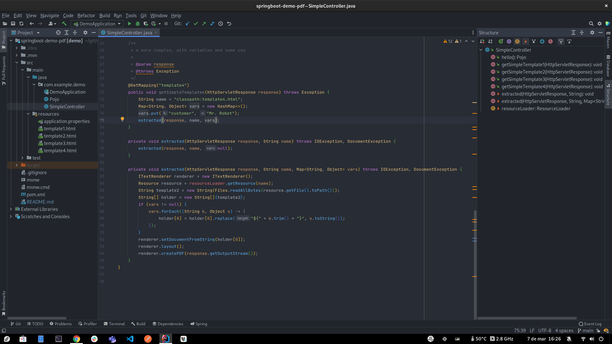

# spring boot demo pdf

simple project to test pdf generation from html templates

## maven dependency

```xml
<dependency>
    <groupId>org.xhtmlrenderer</groupId>
    <artifactId>flying-saucer-pdf-itext5</artifactId>
    <version>9.1.22</version>
</dependency>
```

## basic usage

Load html template as resource, do some processing, then call te pdf library



## limitations

- only inline css will be honored
- images and resources external to the html document will not be loaded

## further reading

- [stackoverflow](https://stackoverflow.com/questions/56752728/how-to-generate-pdf-of-html-page-in-java)
- [examples on github](https://github.com/flyingsaucerproject/flyingsaucer/tree/master/flying-saucer-examples/src/main/java)
